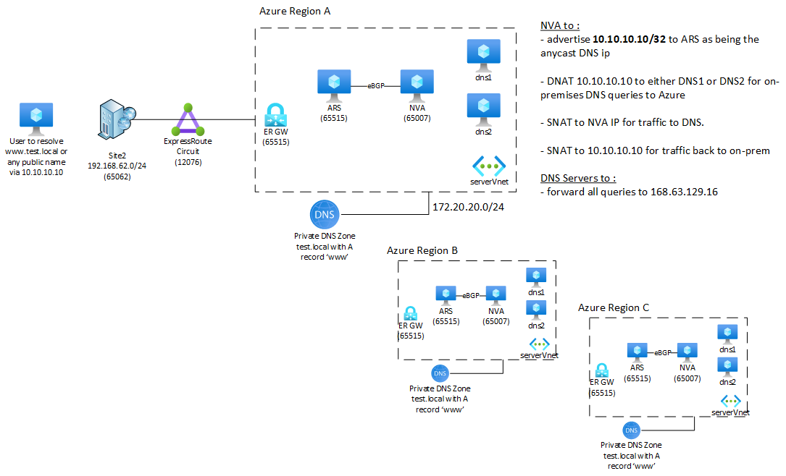

[< back](../README.md)

# anycastDns-lab

## Intent

This lab is to demonstrate that you can advertise the same anycast IP 10.10.10.10 down to all your ER circuits using Azure Route Server and use the NVA to DNAT this IP to a bunch of DNS servers in Azure.
The vnet could use same address space or different address space in each region depending on what you want to achieve.
In this lab, iptables on the NVA just masquerade the DNS servers behing the anycast IP so that real IP DNS server ip is never seen.

## Expected behavior

Pointing your client device from one on-prem location or the other 10.10.10.10 makes it possible to resolve :
- internet DNS entries
- entries from the test.local private DNS zone which is local to each region. I did create a WWW A record with different IPv4 across regions to showcase that you always target the closest DNS server in terms of AS PATH length

## Evolution

Evolution would be to simulated ER remote branches with VM and VPN Gateway in Azure to make this portable ;)

Also, CloudInit values provided for DNS server and NVA are just base64 encoding from the dnsServer.tpl and quagga1.sh files. Better integration would have to be done as i manually encode to base64 and past the value to cloudinit parameter.

## Requirements

Express route circuits in different places

## Parameters

### param location string
This is the region to deploy the architecture to.

### param erAuthKey string
This is the authorization key you may use to connect to the ER circuit

### param erCircuitId string
This is the circuitId in the form "/subscriptions/**sub Id **/resourceGroups/**ER Circuit ResourceGroup**/providers/Microsoft.Network/expressRouteCircuits/**ER Circuit Name**"

## Deployment

Just run the command below from the .\anycastDns-lab folder

```az deployment sub create -n anycast-lab-0 -l westeurope --template-file .\main.bicep ``` to deploy a first region and iterate for multiple region 

(The main2.bicep is just a variant with different address space for my personal tests.)

Resource group info are at the beginning of the main.bicep file.

## Schema

