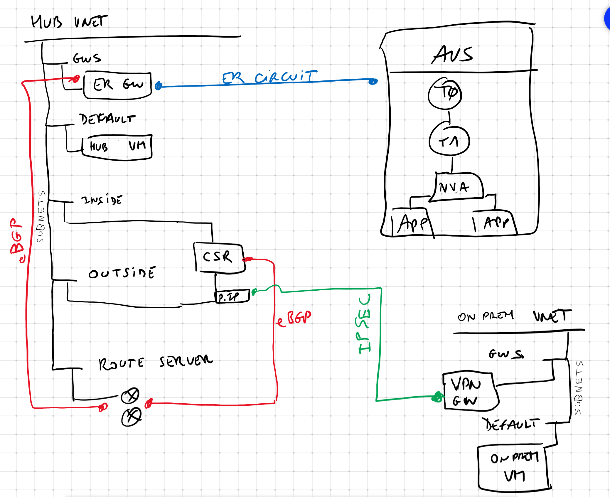

[< back](../README.md)

# avs-lab



## Intent

This lab is to demonstrate usage of the Azure Route Server to propagate route learnt from an NVA (Cisco CSR 1000v with branch site connected via IPSec) to another remote branch connected via an Express Route Circuit

Onprem site is simulated by an Azure VPN Gateway and a VM all in Azure.

## Description

### Requirements

- You have to create a .json parameter file with the two variables below. This file should be kept outside of your repo as i'm doing to keep you secrets secure.

Also you can override the default parameter of variables described earlier by adding them here with the expected value :

```json
{
    "$schema": "https://schema.management.azure.com/schemas/2019-04-01/deploymentParameters.json#",
    "contentVersion": "1.0.0.0",
    "parameters": {
        "adminPassword": {
            "value": "** admin password of CSR **"
        },
        "vpnPreShared": {
            "value": "** VPN Pre shared key value **"
        }
    }
}
```

### Deployment

You need to run the following after :

- installing the latest version of az cli,
- created the resource group where you want to deploy

```
az deployment group create -n Deploy -g avs-lab --template-file main.bicep --parameters ..\..\..\secret\avs-lab.param.json <--- you have to update path to your param file.
```

Once the deployment is done, you will have to configure :

- Peering of your security equipment or the CSR with the router server using the [documentation here](https://docs.microsoft.com/azure/route-server/quickstart-configure-route-server-portal#set-up-peering-with-nva)

- Branch to branch to enabled to allow route propagation between the security equipment, the route server and the Express Gateway. This will enable end to end routing from on-premises site to AVS based VMs

- Configuration of T0/T1 and NVA on AVS is out of the scope of this lab.


### Variables

- location : Azure region where to deploy this architecture

- deployCsr : true/false. This is used if you want to deploy a test CSR in the hub to use it as a VPN gateway collecting IPSEC from remote location. It comes with no config. A sample is in the config directory that enables IPSEC + BGP

- simulateOnPremLocation : true/false. if you want to deploy a vnet with a VPN gateway and a test VM to be connected to the Cisco CSR 1000v or any routing equipment that terminates VPN in the hub

- deployEr : true/false. If  you want to deploy or not the Express Route Gateway.

### HUB Virtual network in Azure

Hub virtual network is devided into multiple subnets :

- GatewaySubnet : host the Express Route gateway that is connected to AVS ER circuit

- default : the hubVm is deployed in that subnet just for connectivity test pursposes from the hub

- inside : it has the internal routing equipment NIC (in this example, the CSR 1000v inside NIC)

- outside : it has the external routing equipment NIC (in this example, the CSR 1000v outside NIC). This NIC also has a public IP attached to receive remote branches IPSEC tunnels

- RouteServerSubnet : this is the subnet reserved to Azure Route Server that must be a /27

### ONPREM virtual network (to simulate onPrem location)

A virtual network called "onprem" is deployed if selected with :

- GAtewaySUbnet : host the VPN Gateway connecting back to the routing equipment into the hub

- default : the onpremVm is deployed in that subnet just for connectivity test pursposes from the onprem simulated location
