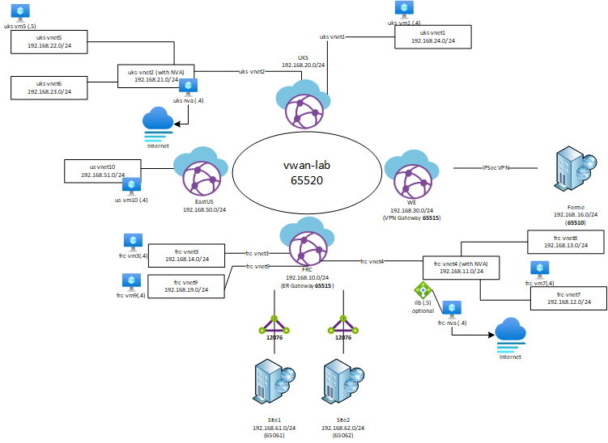

[< back](../README.md)

# vwan-lab



## Intent

This Lab is to demonstrate the publically documented scenario of vWan with an NVA on a spoke along with the BICEP langage to deploy

***This lab is in constent evolution adding component for every test so it is possible that it is not deploying successfully at first time and that you may have to redeploy multiple times, tweeking the templates but the base is there ;)***

## Parameters

Using the below parameter, you can choose to add component :

### param deployEr bool = false 
### param deployErWe bool = false 

Set to true if you want to deploy ER Gateway and circuit connectivity (you must already have an ER Circuit available with an authorization key)

We = WestEurope

### param deployFrcVhub2 bool = false

### param deployVmNxExt bool = false

Deploy VM Network extension in VMs

### param deployFrc2Vhub bool = false

Deploy a second vhub in France

### param deployFrcVpn bool = false

Set to true if you want to deploy a VPN Gateway in the first Frc vHub

### param deployFrcEr2 bool = false

Set to true if you want to deploy an ER Gateway in the second Frc vHub

### param deployUsVhub bool = true
Set to true if you want to deploy a vHub in US

### param deployUsEr bool = false

Set to true if you want to deploy an ER Gateway in the US vHub

### param deployUsVpn bool = false

Set to true if you want to deploy a VPN Gateway in the US vHub

### param deployWeSecuredHub bool = false

Set to true if you want to deploy an AzFw and a secured vHub in West Europe to cover secured hub scenario

### param deployWeSecuredHub bool = false

Set to true to make WE vHub a secured hub

### param deployWeVpn bool = false

Set to true if you want to deploy a VPN Gateway in the WE vHub

### param doFrcSecuredHub bool = true

Set to true to make FRC a secured hub

### param doFrc2SecuredHub bool = false

Set to true to make FRC2 a secured hub

## Requirement

- Personnalize your public IP to be able to connect to NVA VM from Internet (it gets applied to the NVA VM NSG)
It seats into the nic.bicep file :
param mySourceIp string =

- The deployEr switch help overcome waiting 30 min ER GW deployment every time you run deploy the bicep. Set it to true only the first time (still need to troubleshoot the issue as nothing is changed on the ER GW accross deployments)

- The rtVnet of the FRC hub is referencing a 192.168.2.0/24 that represents my onprem site so you would no need it.

- You have to create a .json parameter file with the two variable if you intent to connect an ER Circuit using an authorization key. This file should be kept outside of your repo as i'm doing to keep you secrets secure :

```json
{
    "$schema": "https://schema.management.azure.com/schemas/2019-04-01/deploymentParameters.json#",
    "contentVersion": "1.0.0.0",
    "parameters": {
        "erAuthKey": {
            "value": "**Authorization key value**"
        },
        "erCircuitId": {
            "value": "/subscriptions/**sub Id **/resourceGroups/**ER Circuit ResourceGroup**/providers/Microsoft.Network/expressRouteCircuits/**ER Circuit Name**/peerings/AzurePrivatePeering"
        }
    }
}
```